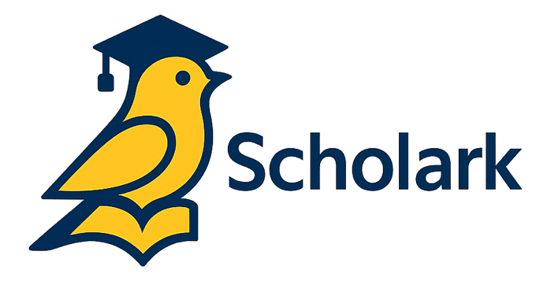

    

**Scholark** (Scholar + Lark) helps researchers and students manage their research schedules effectively.

## 🧰 Key Features

- 📅 **Conference Tracking**: Add and browse conference metadata (name, dates, abstract/paper deadlines, website, etc.)
- 🏷️ **Custom Labels**: Mark conferences with user-defined labels (e.g. "Interested", "Attending")
- 👥 **Community Sharing**: Share and discover conference info submitted by other users

## 🏗️ Technology Stack

### 🖥️ **Frontend**

- **TypeScript** as frontend language
- **React Router** as frontend framework
- **React** as UI library
- **Tailwind CSS** as styling system
- **shadcn/ui** as React component library
- **Vite** as build tool
- **Hey API** for API client autogeneration
- **pnpm** as package manager

### 🧠 **Backend**

- **Python** as backend language
- **FastAPI** as web framework
- **PostgreSQL** as database
- **SQLModel** as ORM
- **Alembic** for database migrations
- **OAuth2** and **LDAP** for authentication
- **uv** as Python package manager

### 🛠️ **Tooling**

- **Docker** for containerization

---

## 🚀 Getting Started
TBW
